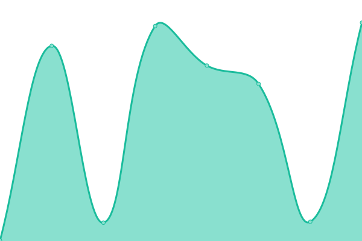

# [📈 Live Status](https://meese-enterprises.github.io/uptime-monitor): <!--live status--> **🟧 Partial outage**

This repository contains the open-source uptime monitor and status page for [Meese Enterprises](https://meese.enterprises), powered by [Upptime](https://github.com/upptime/upptime).

With [Upptime](https://upptime.js.org), you can get your own unlimited and free uptime monitor and status page, powered entirely by a GitHub repository. We use [Issues](https://github.com/meese-enterprises/uptime-monitor/issues) as incident reports, [Actions](https://github.com/meese-enterprises/uptime-monitor/actions) as uptime monitors, and [Pages](https://meese-enterprises.github.io/uptime-monitor) for the status page.

<!--start: status pages-->
<!-- This summary is generated by Upptime (https://github.com/upptime/upptime) -->
<!-- Do not edit this manually, your changes will be overwritten -->
<!-- prettier-ignore -->
| URL | Status | History | Response Time | Uptime |
| --- | ------ | ------- | ------------- | ------ |
|  [Meese Enterprises](https://meese.enterprises) | 🟩 Up | [meese-enterprises.yml](https://github.com/meese-enterprises/uptime-monitor/commits/HEAD/history/meese-enterprises.yml) | 

 460ms
     
 | 

<a href="https://meese-enterprises.github.io/uptime-monitor/history/meese-enterprises">55.97%</a>
    

|  [MeeseOS](https://aaronmeese.com) | 🟥 Down | [meese-os.yml](https://github.com/meese-enterprises/uptime-monitor/commits/HEAD/history/meese-os.yml) | 

 434ms
     
 | 

<a href="https://meese-enterprises.github.io/uptime-monitor/history/meese-os">97.62%</a>
    

<!--end: status pages-->

[**Visit our status website →**](https://meese-enterprises.github.io/uptime-monitor)

## 📄 License

- Powered by: [Upptime](https://github.com/upptime/upptime)
- Code: [MIT](./LICENSE) © [Meese Enterprises](https://meese.enterprises)
- Data in the `./history` directory: [Open Database License](https://opendatacommons.org/licenses/odbl/1-0/)
